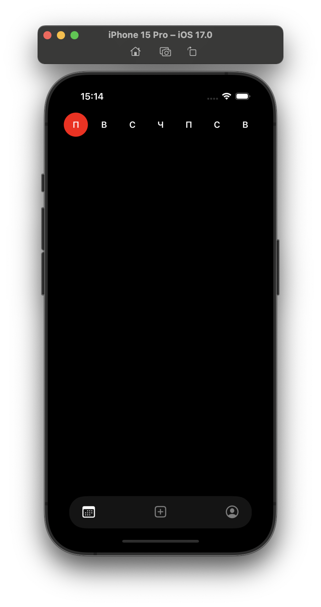
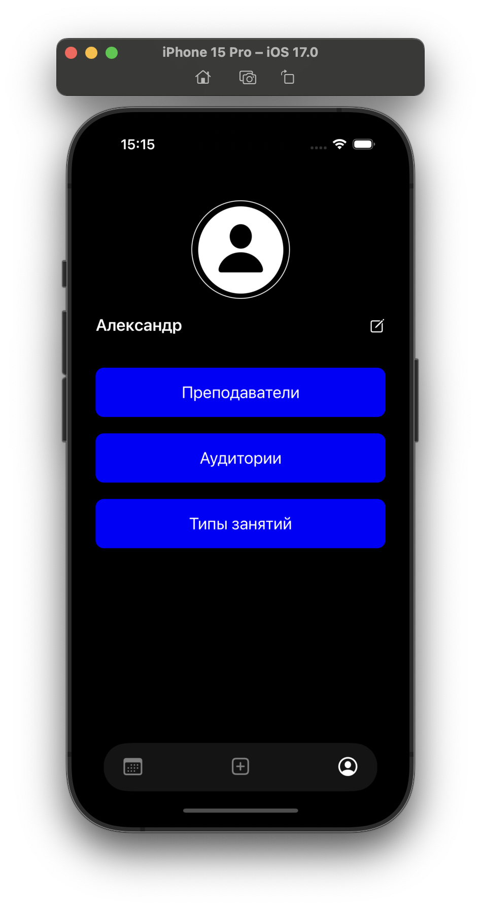
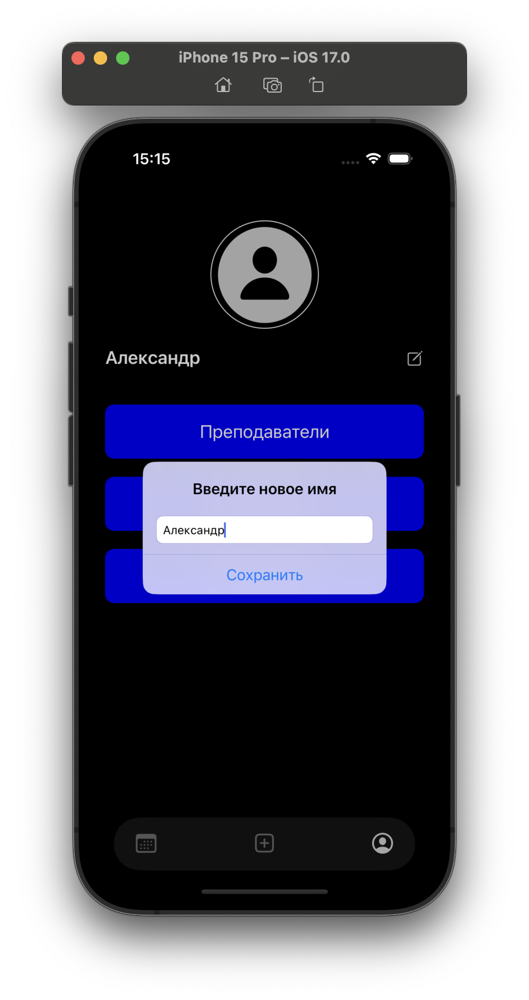
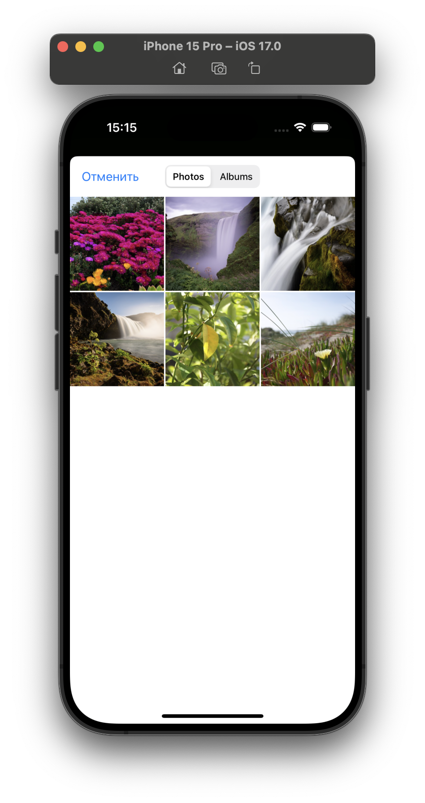
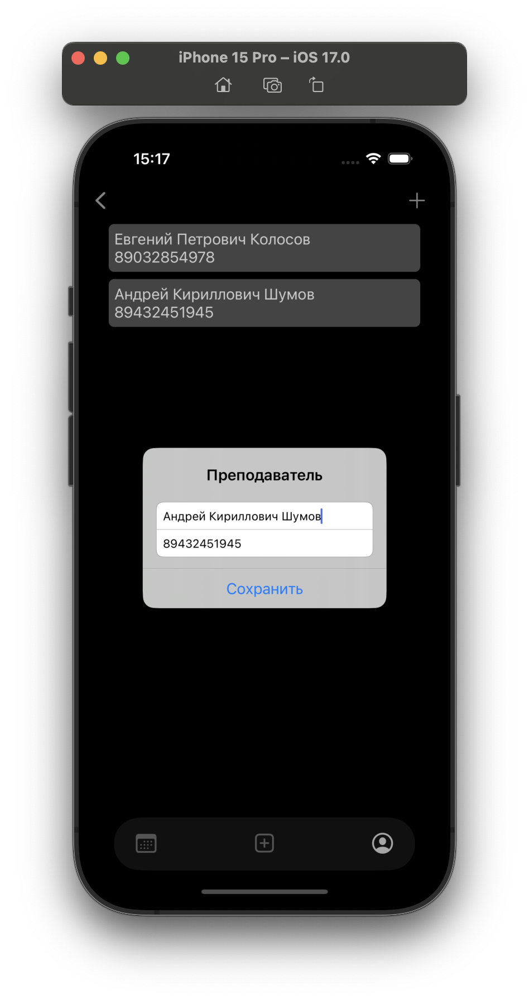
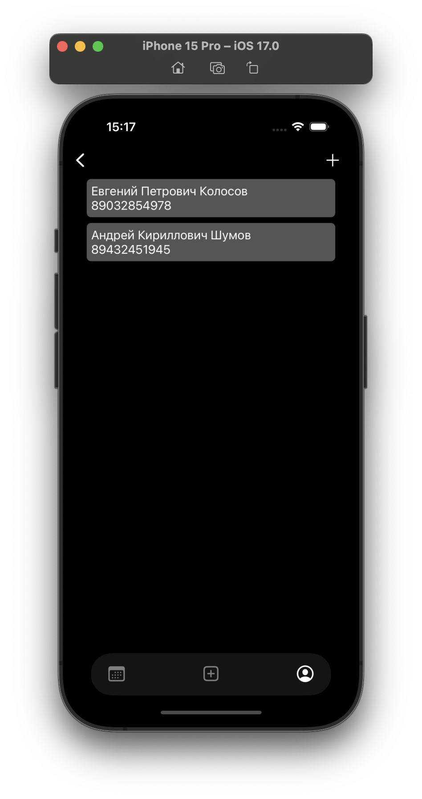
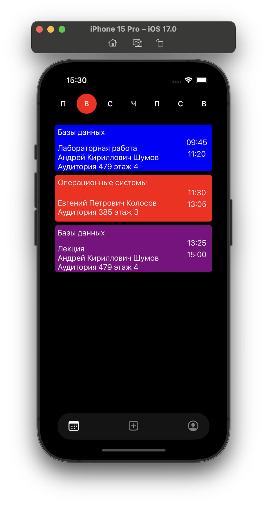
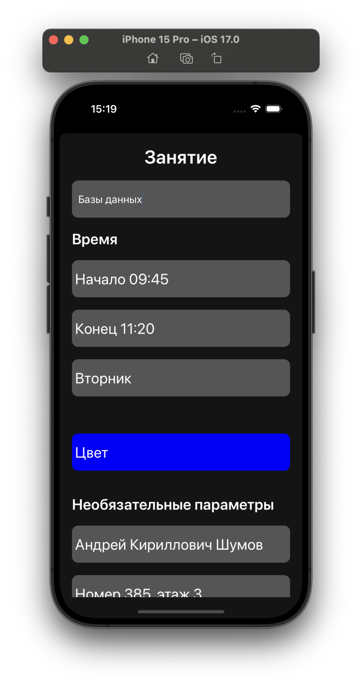
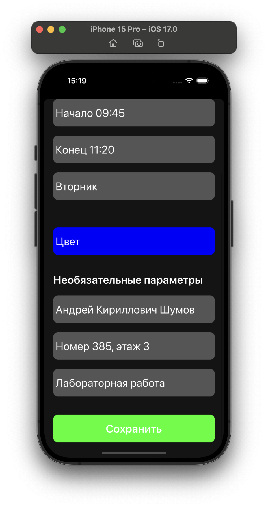

# Schedule

Приложение для создания собственного расписания занятий.

- MVVM
- Clean Architecture
- CoreData
- UIKit

# Галерея

<li>
  Пустое расписание
</li>
<li>
  
</li>
<li>
  Профиль
</li>
<li>
  
</li>
<li>
 Изменение имени профиля
</li>
<li>
  
</li>
<li>
  Изменение фото профиля
</li>
<li>
  
</li>
<li>
  Создание/редактирование списка преподавателей
</li>
<li>
  
</li>
<li>
  Список преподавателей
</li>
<li>
  
</li>
<li>
  Заполненное расписание
</li>
<li>
  
</li>
<li>
  Создание/редактирование занятия
</li>
<li>
  
  
</li>

